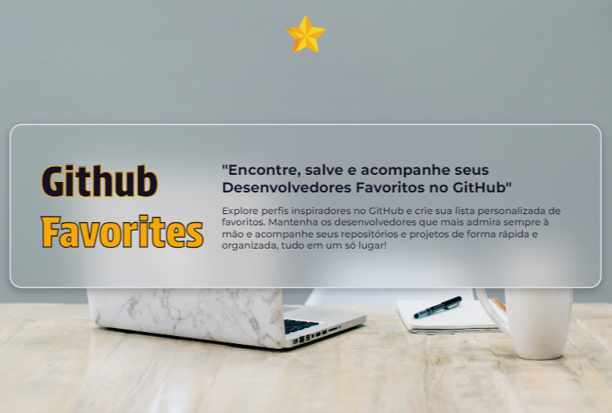
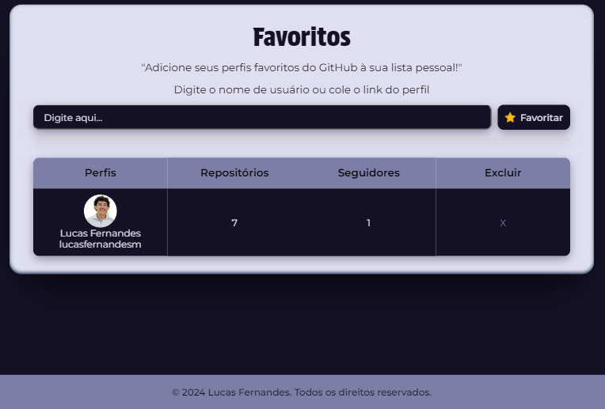

<h1 align="center"> Github Favorites </h1>

"Encontre, salve e acompanhe seus Desenvolvedores Favoritos no GitHub" 
Explore perfis inspiradores no GitHub e crie sua lista personalizada de favoritos. Mantenha os desenvolvedores que mais admira sempre à mão e acompanhe seus repositórios e projetos de forma rápida e organizada, tudo em um só lugar!

  <a href="#Technologies">Technologies</a>&nbsp;&nbsp;&nbsp;|&nbsp;&nbsp;&nbsp;
  <a href="#Project">Project</a>&nbsp;&nbsp;&nbsp;|&nbsp;&nbsp;&nbsp;
  <a href="#Link-to-view">Link to view</a>&nbsp;&nbsp;&nbsp;|&nbsp;&nbsp;&nbsp;
  <a href="#memo-license">License</a>

  

  
<h1 align="center">
  
</h1>

<h1 align="center">
  
</h1>

  
<h2 align="left" id="Technologies"> &nbsp;&nbsp; Technologies </h2>

This project was developed with the following technologies:
- [HTML]
- [CSS]
- [JavaScript]
- [Git]

  
<h2 align="left" id="Project"> &nbsp;&nbsp; Project </h2>

  - Add favorite profiles through a simple search by username or URL. 
  - Autocomplete, automatic suggestions as you type. 
  - Smart validations, alerts the user if they forget to type in the search field, if they type a profile already listed or if the profile does not exist. 
  - Displays complete information in the list: photo and username, number of followers, repositories, and option to delete. With direct links to profile, repository page and followers page.
  - Remove favorite profiles at any time. 
  - Local storage, your list is saved in the browser, ensuring that it remains available even after reloading. 
  - Responsive design, optimized for any device.  

  
<h2 align="left" id="Link-to-view"> &nbsp;&nbsp;   Link to view </h2>

[Github Favorites](https://lucasfernandesm.github.io/Git-Fav-App/)

  
## :memo: License

This project is under the MIT license.

---
